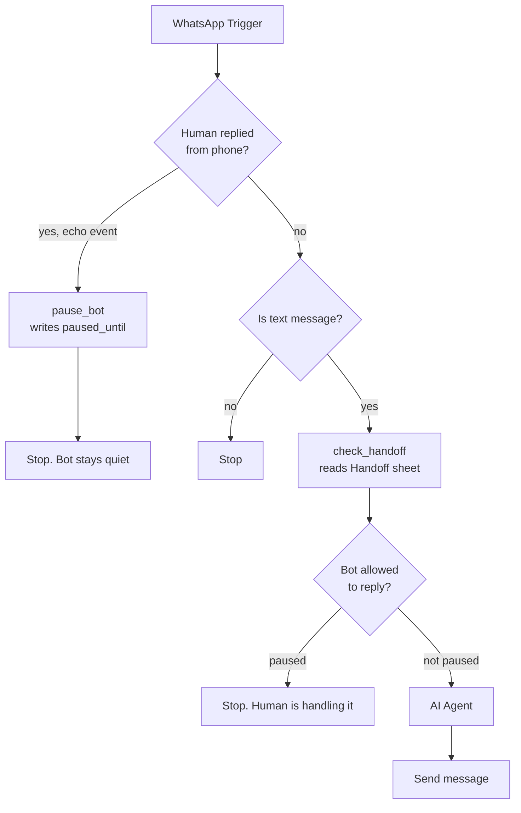
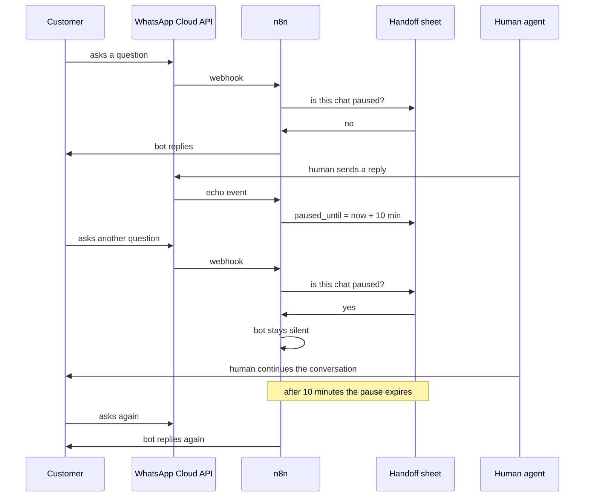

# Human Handoff

Letting a human agent and the AI agent work on the same WhatsApp number without talking over each other.

---

## The problem

The assessment asks for co-existence: a human replies from the phone while automation also runs on the same number.

Co-existence itself is blocked on this account. It requires Embedded Signup, which requires Tech Provider onboarding, which is gated behind Business Verification and App Review. Both are reviewed by Meta and take days. See the README for the full explanation.

But the harder half of the problem is not the connection. It is what happens once both sides are live.

If a human replies from the phone while the bot is also replying, the customer gets two answers to the same question. That part can be built and tested today, and it is built here.

---

## How it works



Two things were added to the main workflow.

**Detecting the human.** When a message is sent from the phone rather than received from a customer, WhatsApp delivers it to the webhook as an echo event. It arrives under `message_echoes` instead of `messages`. The first If node checks for that.

**Pausing the bot.** When an echo arrives, `pause_bot` writes a row to a Handoff sheet with `paused_until` set to ten minutes ahead. Every incoming customer message then reads that sheet first. If the chat is still paused, the workflow stops before the AI agent runs.

The pause expires on its own. No one has to switch the bot back on.

---

## The conversation over time



---

## Setup

### 1. Add the Handoff sheet

In the same spreadsheet, create a sheet named `Handoff` with three columns:

| Phone | paused_until | last_human_reply |
|---|---|---|

Leave it empty. Rows are created automatically.

### 2. Import the workflows

- `workflow.json` is the main workflow, now with the handoff nodes
- `human-agent-reply-workflow.json` lets a human reply without co-existence

Select your own credentials after importing.

### 3. Subscribe to echo events

In the Meta app dashboard go to WhatsApp, then Configuration, then Webhook fields. Subscribe to `message_echoes` in addition to `messages`.

Echo events only fire once co-existence is active. Until then the field can be subscribed but nothing arrives on it.

---

## Replying as a human today

Co-existence is what lets a human reply from the WhatsApp Business App. Without it, the phone cannot send on that number at all.

But the Cloud API can. So `human-agent-reply-workflow.json` gives the human a simple form:

```
Customer phone number:  [ 8801838457404 ]
Your message:           [ ...          ]
```

Submitting it does two things. It sends the message from the same business number, so the customer sees it in the same thread. And it writes the pause row, so the bot goes quiet for ten minutes.

That demonstrates the whole handoff end to end on a single number: human and AI in one conversation, with no double replies. The only difference from real co-existence is where the human types. Once co-existence is enabled, the phone app replaces the form and the same pause logic handles it, because the echo branch is already wired.

---

## Design notes

**Why a sheet and not memory.** The pause state has to be readable by a different execution than the one that wrote it. n8n Simple Memory is scoped to the agent and does not survive a restart. A sheet row is durable and visible, which also makes it easy to see who is being handled by a human. In production a small database table or Redis key with a TTL would be better.

**Why a timeout instead of a switch.** A manual switch has to be turned back off, and it will be forgotten. A ten minute window that renews on every human reply means the bot resumes on its own once the human stops. Change the window by editing the `10*60*1000` in `pause_bot`.

**Why check on the way in.** The pause is checked before the AI agent runs, not after. That avoids spending a model call and a Sheets read on a message the bot is not going to answer.

**What is not handled.** There is no explicit signal for a human to hand the chat back early, and no per agent tracking. Both are small additions to the same sheet.
