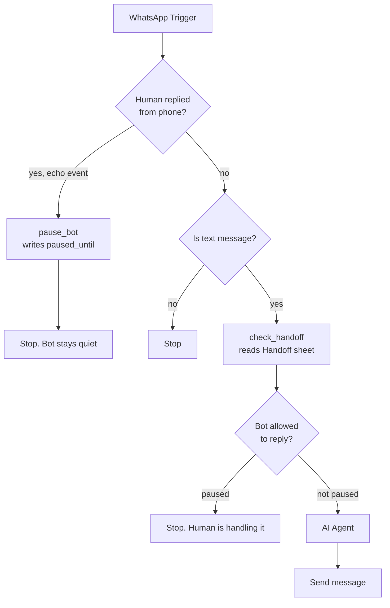
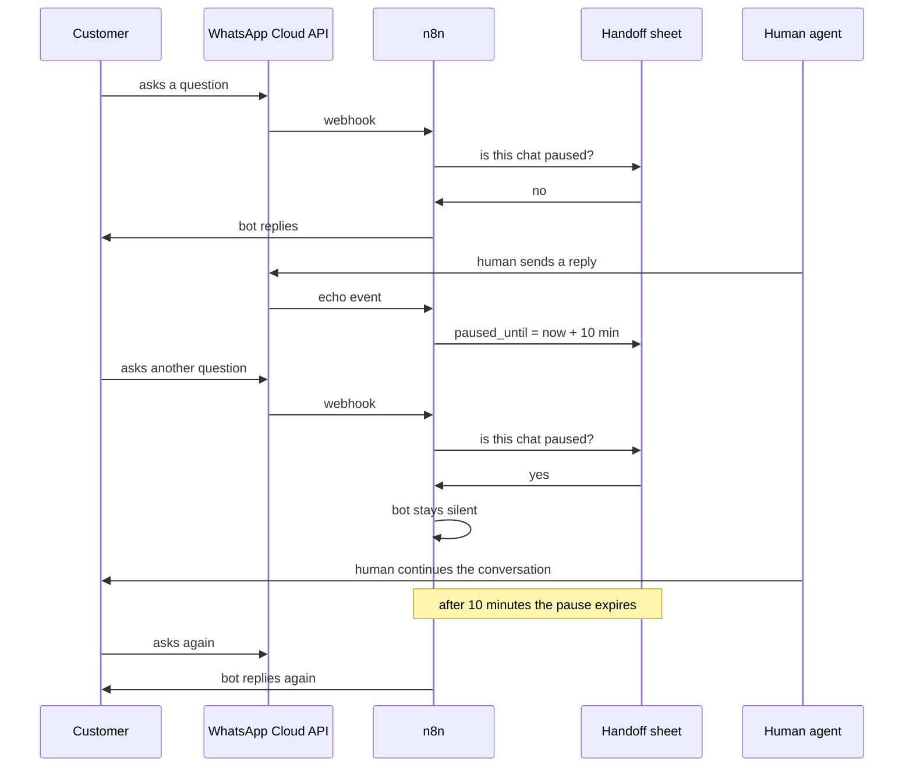

# WhatsApp AI Automation — Human Hands off + Ai Agent + n8n

A proof-of-concept WhatsApp ordering assistant built with the **Meta WhatsApp Business Cloud API**, **n8n**, **Google Gemini**, and **Google Sheets**.

The system receives WhatsApp messages through a webhook, uses an AI Agent to understand the conversation, checks product stock, looks up existing orders, saves new orders, and sends replies back through the WhatsApp Cloud API.

> Built as a technical assessment for an AI Automation Intern role.

## Demo

**Video:** https://drive.google.com/file/d/1HFsx8P3xSWKu9URH--vdEvoJ53u1h8ZU/view?usp=sharing

## Features

- WhatsApp Cloud API message receiving and sending
- n8n webhook-based automation
- Google Gemini-powered AI Agent
- Conversation memory using the customer's WhatsApp number
- Stock lookup from Google Sheets
- Existing-order lookup from Google Sheets
- New-order creation in Google Sheets
- Meta WhatsApp message-template workflow
- Text-message filtering
- Dynamic sender/recipient handling
- Documented phone + Cloud API co-existence approach and limitation

# Human Handoff

Letting a human agent and the AI agent work on the same WhatsApp number without talking over each other.

---

## The problem

The assessment asks for co-existence: a human replies from the phone while automation also runs on the same number.

Co-existence itself is blocked on this account. It requires Embedded Signup, which requires Tech Provider onboarding, which is gated behind Business Verification and App Review. Both are reviewed by Meta and take days. See the README for the full explanation.

But the harder half of the problem is not the connection. It is what happens once both sides are live.

If a human replies from the phone while the bot is also replying, the customer gets two answers to the same question. That part can be built and tested today, and it is built here.

---

## How it works



Two things were added to the main workflow.

**Detecting the human.** When a message is sent from the phone rather than received from a customer, WhatsApp delivers it to the webhook as an echo event. It arrives under `message_echoes` instead of `messages`. The first If node checks for that.

**Pausing the bot.** When an echo arrives, `pause_bot` writes a row to a Handoff sheet with `paused_until` set to ten minutes ahead. Every incoming customer message then reads that sheet first. If the chat is still paused, the workflow stops before the AI agent runs.

The pause expires on its own. No one has to switch the bot back on.

---

## The conversation over time



---

## Setup

### 1. Add the Handoff sheet

In the same spreadsheet, create a sheet named `Handoff` with three columns:

| Phone | paused_until | last_human_reply |
|---|---|---|

Leave it empty. Rows are created automatically.

### 2. Import the workflows

- `workflow.json` is the main workflow, now with the handoff nodes
- `human-agent-reply-workflow.json` lets a human reply without co-existence

Select your own credentials after importing.

### 3. Subscribe to echo events

In the Meta app dashboard go to WhatsApp, then Configuration, then Webhook fields. Subscribe to `message_echoes` in addition to `messages`.

Echo events only fire once co-existence is active. Until then the field can be subscribed but nothing arrives on it.

---

## Replying as a human today

Co-existence is what lets a human reply from the WhatsApp Business App. Without it, the phone cannot send on that number at all.

But the Cloud API can. So `human-agent-reply-workflow.json` gives the human a simple form:

```
Customer phone number:  [ 8801838457404 ]
Your message:           [ ...          ]
```

Submitting it does two things. It sends the message from the same business number, so the customer sees it in the same thread. And it writes the pause row, so the bot goes quiet for ten minutes.

That demonstrates the whole handoff end to end on a single number: human and AI in one conversation, with no double replies. The only difference from real co-existence is where the human types. Once co-existence is enabled, the phone app replaces the form and the same pause logic handles it, because the echo branch is already wired.

---

## Design notes

**Why a sheet and not memory.** The pause state has to be readable by a different execution than the one that wrote it. n8n Simple Memory is scoped to the agent and does not survive a restart. A sheet row is durable and visible, which also makes it easy to see who is being handled by a human. In production a small database table or Redis key with a TTL would be better.

**Why a timeout instead of a switch.** A manual switch has to be turned back off, and it will be forgotten. A ten minute window that renews on every human reply means the bot resumes on its own once the human stops. Change the window by editing the `10*60*1000` in `pause_bot`.

**Why check on the way in.** The pause is checked before the AI agent runs, not after. That avoids spending a model call and a Sheets read on a message the bot is not going to answer.

**What is not handled.** There is no explicit signal for a human to hand the chat back early, and no per agent tracking. Both are small additions to the same sheet.
## Architecture

```text
Customer on WhatsApp
        |
        v
Meta WhatsApp Cloud API
        |
        v
n8n WhatsApp Trigger
        |
        v
Text Message Filter
        |
        v
Google Gemini AI Agent
   |       |       |
   |       |       +--> save_order -> Google Sheets
   |       +----------> find_order -> Google Sheets
   +------------------> check_stock -> Google Sheets
        |
        v
WhatsApp Cloud API
        |
        v
Customer receives reply
```

## Tech Stack

- **Meta WhatsApp Business Cloud API** — messaging layer
- **n8n** — workflow automation and webhook handling
- **Google Gemini** — language model / AI Agent
- **Google Sheets** — stock and order data store

## Repository Files

```text
workflow.json
    Main n8n workflow for receiving, processing and replying to WhatsApp messages.

template-workflow.json
    Example workflow for sending an approved WhatsApp message template.

README.md
    Project documentation and implementation notes.

docs/coexistence.md
    Phone + Cloud API co-existence research and limitation notes.
```

## Google Sheets Structure

### `check_stock`

| Product | Quantity | Status |
|---|---:|---|
| Chicken Thali | 20 | Available |
| Veg Thali | 10 | Available |

### `Orders`

| Customer Name | Phone | Item | Quantity | Description | Status |
|---|---|---|---:|---|---|

### Workflow tools

| Tool | Purpose | Operation |
|---|---|---|
| `check_stock` | Check current product stock | Read rows |
| `find_order` | Find an existing order | **Get Row(s)** |
| `save_order` | Save a confirmed new order | Append row |

> **Important:** `find_order` must use **Get Row(s)**, not Append. `save_order` is the node that uses Append.

## Setup

### 1. Meta WhatsApp Cloud API

1. Create/configure a Meta app with the WhatsApp product.
2. Get the WhatsApp Business Account ID and Phone Number ID.
3. Configure an access token with the permissions required by the WhatsApp Cloud API.
4. Configure the n8n WhatsApp Trigger webhook in the Meta dashboard.
5. Subscribe the application to WhatsApp message events.

Do not commit access tokens, app secrets, or other credentials to this repository.

### 2. n8n

1. Import `workflow.json` into n8n.
2. Reconnect your own WhatsApp, Google Sheets, and Google Gemini credentials.
3. Confirm that the three Google Sheets tools point to the correct spreadsheet.
4. Confirm that `find_order` is configured for **Get Row(s)**.
5. Save and activate the workflow.

### 3. Google Sheets

Create the `check_stock` and `Orders` sheets using the column structures shown above, then connect the Google Sheets credential in n8n.

## Workflow Logic

```text
WhatsApp Trigger
      |
      v
If: message type == text
      |
      v
AI Agent
  |   |   |
  |   |   +--> save_order (append)
  |   +------> find_order (Get Row(s))
  +----------> check_stock (read)
      |
      v
Send WhatsApp Message
```

### Message filtering

WhatsApp webhooks can contain message events as well as delivery/read/status events. The workflow checks the message type and only passes text messages to the AI Agent.

### Conversation memory

The session key is the customer's WhatsApp number:

```text
{{ $('WhatsApp Trigger').item.json.messages[0].from }}
```

This keeps each customer's conversation context separate.

The current demo uses n8n Simple Memory. For production, durable shared memory such as PostgreSQL or Redis would be more appropriate.

### Dynamic WhatsApp reply

The workflow takes the sender and recipient information from the incoming webhook instead of hardcoding a customer number. This makes the workflow reusable for different conversations.

## WhatsApp Message Templates

WhatsApp Business messaging uses approved message templates when a business needs to initiate or continue a conversation outside the applicable customer-service window.

`template-workflow.json` is included as a separate example for sending an approved template. The template name and language must match the template configured in WhatsApp Manager.

## Phone + Cloud API Co-existence

### What it means

WhatsApp phone + Cloud API co-existence allows a business to keep using the WhatsApp Business App while also connecting the same business number to Cloud API automation, subject to Meta's eligibility and onboarding requirements.

This is different from the normal Cloud API phone-number registration flow.

### What happened in this assessment

The number was initially registered through the standard Cloud API flow. That is not the co-existence onboarding path, so the intended co-existence setup could not be completed within the assessment environment/time window.

The co-existence onboarding path requires the appropriate Meta Embedded Signup / partner setup and eligibility. Business verification and app/solution review requirements can also apply depending on the onboarding route.

Because those Meta-side requirements could not be completed within the 48-hour assessment window, co-existence is documented here rather than claimed as a working feature.

See [`docs/coexistence.md`](docs/coexistence.md) for the detailed explanation and proposed human-handoff logic.

### Human handoff concept

If a human replies from the WhatsApp Business App while automation is active, the workflow should detect the relevant echo/sent event and temporarily suppress automated replies for that conversation. This prevents the human and AI from responding at the same time.

This handoff logic was not presented as fully implemented because the co-existence onboarding itself was not completed.

## Known Limitations

- Phone + Cloud API co-existence was not fully configured in the assessment environment.
- Simple Memory is not durable across restarts/workers.
- Webhook signature verification should be added for a production deployment.
- Idempotency/duplicate-message handling should be added to prevent duplicate order creation when webhook retries occur.
- The demo currently focuses on text messages.
- Credentials are intentionally not included in the exported workflow.

## Security Notes

Never commit the following to GitHub:

- Meta access tokens
- Meta app secrets
- n8n credentials
- Google OAuth credentials
- Google service-account private keys
- `.env` files containing secrets

Use environment variables or the credential manager provided by n8n instead.

## Assessment Summary

This project demonstrates a complete working automation path for:

**WhatsApp → Webhook → AI Agent → Google Sheets tools → WhatsApp reply**

The phone + Cloud API co-existence limitation is explicitly documented rather than presented as completed functionality.
